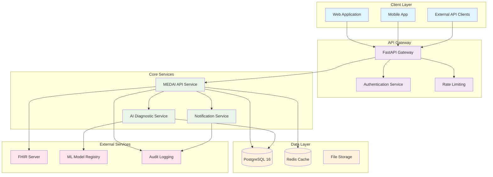
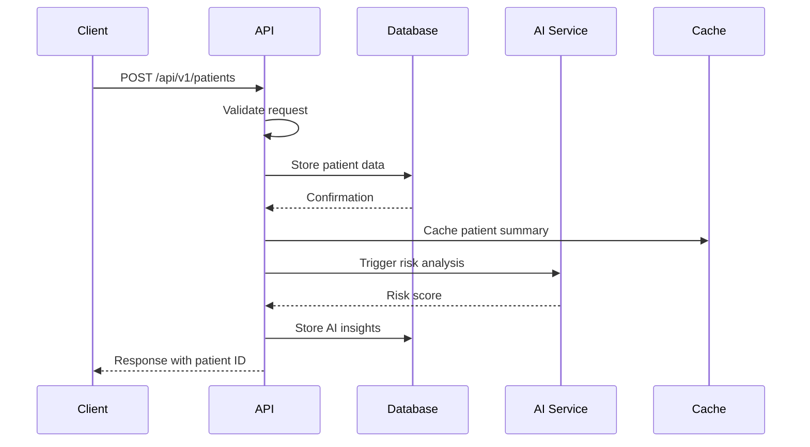
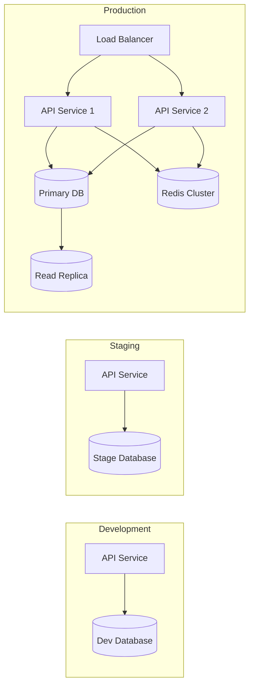

# MEDAI System Architecture Overview

## High-Level Architecture

MEDAI is a modern Electronic Health Record (EHR) system built with a microservices architecture, designed for scalability, security, and medical compliance.



## Core Components

### 1. API Service (FastAPI)
- **Technology**: FastAPI + SQLModel + PostgreSQL
- **Responsibilities**:
  - Patient data management
  - Medical records CRUD operations
  - Authentication and authorization
  - Medical compliance enforcement
  - API documentation and validation

### 2. Database Layer
- **Primary Database**: PostgreSQL 16
  - Patient records
  - Medical data
  - User management
  - Audit trails
- **Cache Layer**: Redis
  - Session management
  - Frequently accessed data
  - Real-time notifications

### 3. AI Diagnostic Service
- **Technology**: Python + TensorFlow/PyTorch
- **Capabilities**:
  - Medical image analysis
  - Diagnostic recommendations
  - Risk prediction models
  - Natural language processing for clinical notes

## Data Flow



## Security Architecture

### Authentication & Authorization
- JWT-based authentication
- Role-based access control (RBAC)
- Medical professional verification
- Session management with Redis

### Data Protection
- End-to-end encryption
- Database encryption at rest
- TLS 1.3 for data in transit
- Regular security audits

### Medical Compliance
- HIPAA compliance
- GDPR/LGPD compliance
- FDA 21 CFR Part 11 compliance
- Audit logging for all operations

## Deployment Architecture



## Technology Stack

### Backend
- **Framework**: FastAPI 0.104+
- **ORM**: SQLModel (SQLAlchemy 2.0)
- **Database**: PostgreSQL 16
- **Cache**: Redis 7
- **Task Queue**: Celery (optional)

### Development & DevOps
- **Package Management**: Poetry
- **Code Quality**: Black, Ruff, mypy
- **Testing**: pytest, pytest-cov
- **CI/CD**: GitHub Actions
- **Containerization**: Docker + Docker Compose

### Monitoring & Observability
- **Logging**: Structured logging with structlog
- **Metrics**: Prometheus (future)
- **Tracing**: OpenTelemetry (future)
- **Health Checks**: Built-in health endpoints

## API Design

### RESTful Endpoints
```
GET    /healthz              - Health check
GET    /api/v1/patients      - List patients
POST   /api/v1/patients      - Create patient
GET    /api/v1/patients/{id} - Get patient details
PUT    /api/v1/patients/{id} - Update patient
DELETE /api/v1/patients/{id} - Delete patient (soft delete)
```

### Data Models
- Patient management
- Medical records
- User authentication
- Audit trails
- AI diagnostic results

## Scalability Considerations

### Horizontal Scaling
- Stateless API design
- Database read replicas
- Redis clustering
- Container orchestration ready

### Performance Optimization
- Database indexing strategy
- Redis caching layer
- Async/await throughout
- Connection pooling

### Future Enhancements
- Microservices decomposition
- Event-driven architecture
- CQRS pattern implementation
- GraphQL API gateway